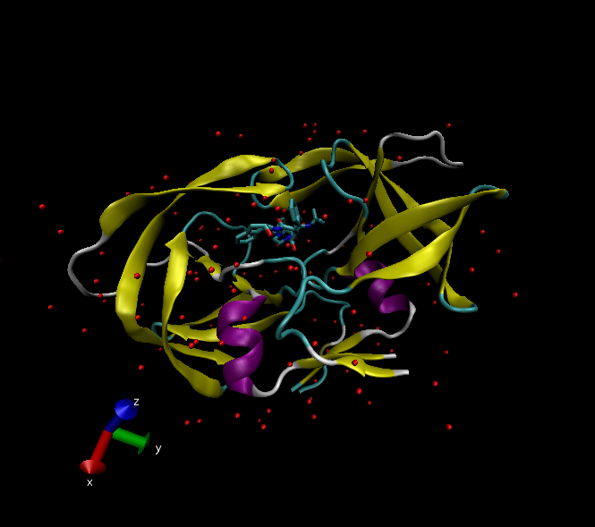
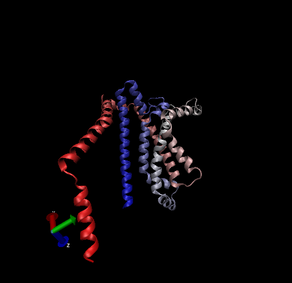

## The PDB Database

The PDB is the main repository for 3d structure data of biomolecules. Here we explore its composition.

```{r}
pdbData <- read.csv("Data Export Summary.csv", row.names=1)
pdbData
```

> Q1: What percentage of structures in the PDB are solved by X-Ray and Electron Microscopy. 87.197% of structures are solved by X-ray and 5.354% of structures are solved by EM.

```{r}
tot.method <- colSums(pdbData)
round(tot.method/tot.method["Total"] * 100, 3)
```

> Q2: What proportion of structures in the PDB are protein? 87.27 proportion of structures in the PDB are protein.

```{r}
ans <- pdbData$Total[1] / sum(pdbData$Total) * 100
round(ans, 3)
```

The answer to this question is `r round(ans, 3)` % of total structures.

> Q3: Type HIV in the PDB website search box on the home page and determine how many HIV-1 protease structures are in the current PDB? 4483 structures.

## Visualizing the HIV-1 Protease Structure

> Q4: Water molecules normally have 3 atoms. Why do we see just one atom per water molecule in this structure? The hydrogen atom is very small in comparison to the rest of the molecule.

> Q5: There is a conserved water molecule in the binding site. Can you identify this water molecule? What residue number does this water molecule have (see note below)? Residue number 308

VMD generated image of HIV-protease, PDB code: 1hsg



## Sequence Viewer Extension

> Q6: As you have hopefully observed HIV protease is a homodimer (i.e. it is composed of two identical chains). With the aid of the graphic display and the sequence viewer extension can you identify secondary structure elements that are likely to only form in the dimer rather than the monomer? Beta-pleated sheets and alpha helices are likely to form in the dimer.

## Bio3D in R

```{r}
library(bio3d)

pdb <- read.pdb("1hsg")
pdb
```

> Q7: How many amino acid residues are there in this pdb object? 198 residues

> Q8: Name one of the two non-protein residues? MK1

> Q9: How many protein chains are in this structure? 2 protein chains

## Comparative structure analysis of Adenylate Kinase

Extract the sequence for ADK

```{r}
aa <- get.seq("1ake_A")
aa
```

```{r}
blast <- blast.pdb(aa)
hits <- plot(blast)
hits$pdb.id
```

> Q10. Which of the packages above is found only on BioConductor and not CRAN? msa

> Q11. Which of the above packages is not found on BioConductor or CRAN? bio3d-view

> Q12. True or False? Functions from the devtools package can be used to install packages from GitHub and BitBucket? True

> Q13. How many amino acids are in this sequence, i.e. how long is this sequence? 214 amino acids

## Normal Mode Analysis (NMA)

```{r}
pdb <- read.pdb("1ake")
chainA <- trim.pdb(pdb, chain="A")
modes <- nma(chainA)
m7 <- mktrj.nma(modes, mode=7, file="mode_7.pdb")
```

> Q14. What do you note about this plot? Are the black and colored lines similar or different? Where do you think they differ most and why? There are regions that are similar as well as regions that are dissimilar. The black and colored lines are sometimes so similar that they overlap, but other times they vary as the colored lines spike upwards compared to the black lines that stay lower on the graph. I think they differ most at regions that bind nucleotides because of the flexibility that is required for this process to take place.

## Find-A-Gene Project predicted structure using AlphaFold.


